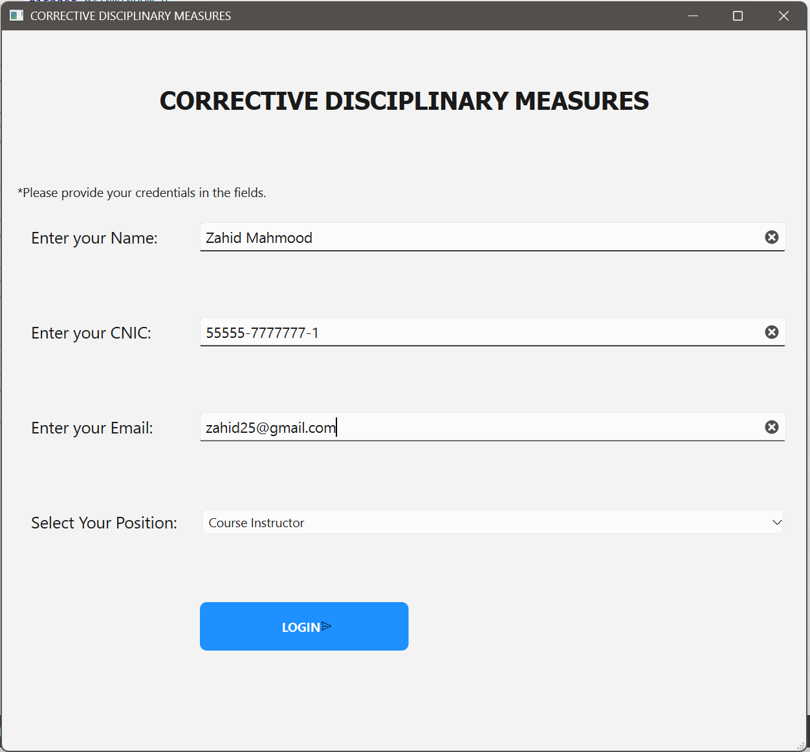
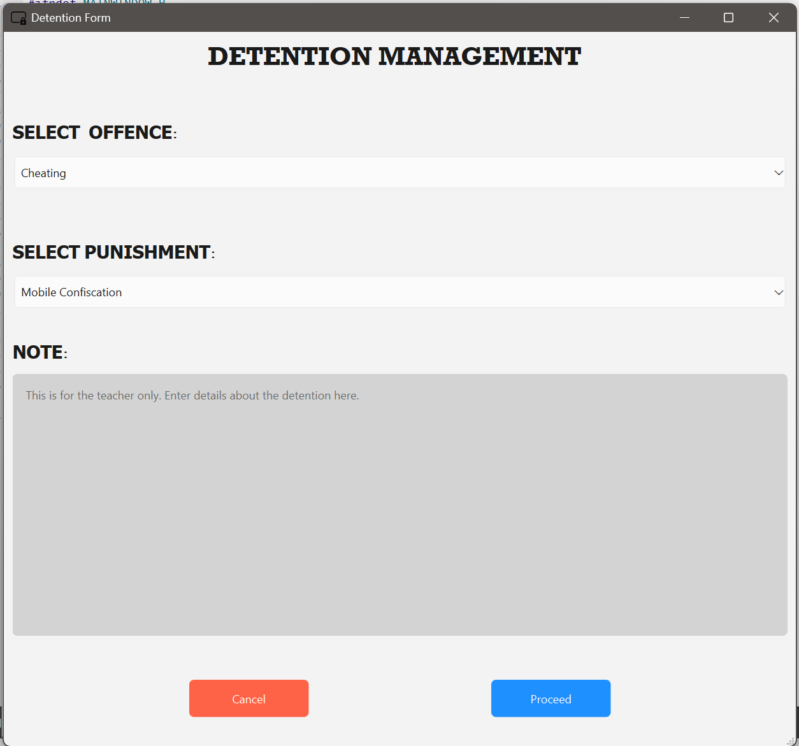
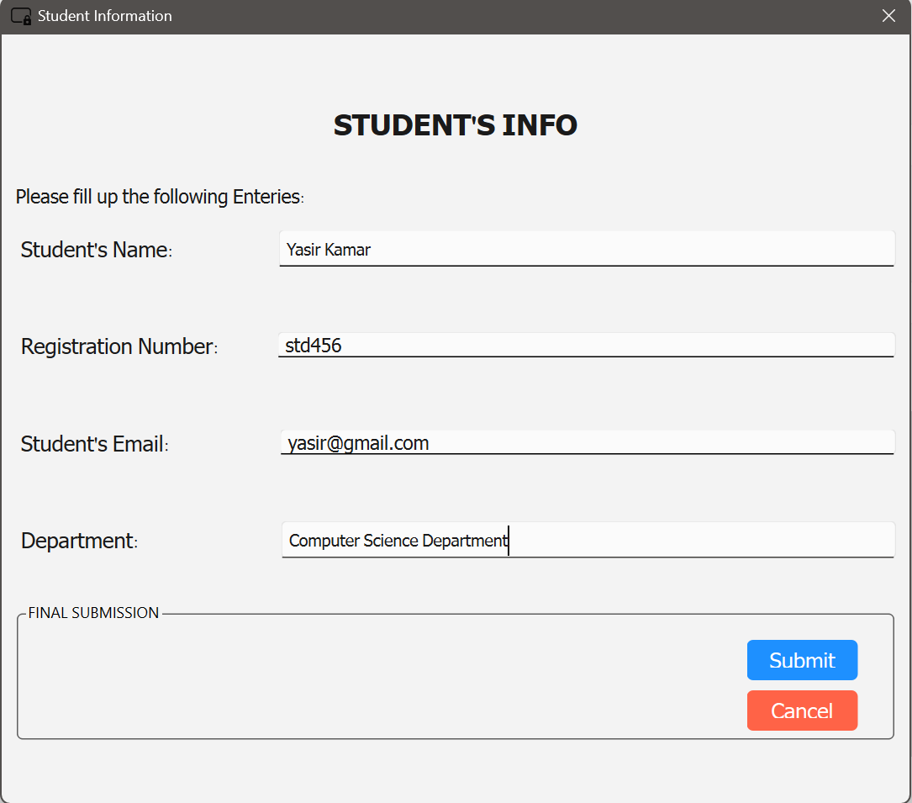
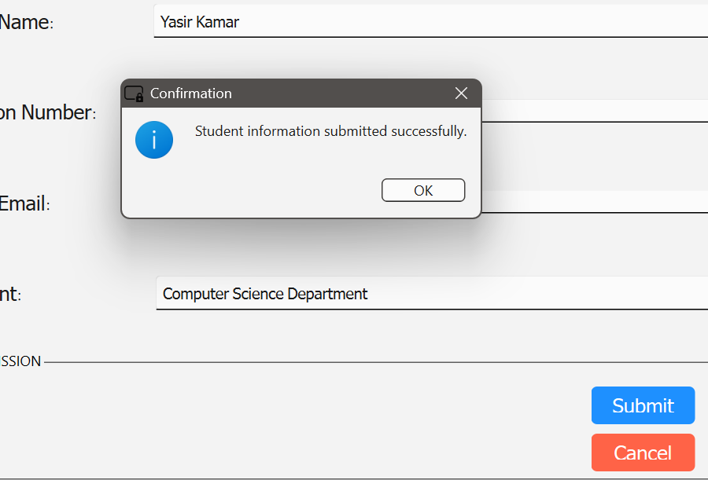

# Corrective Disciplinary Measures System

A desktop application built with **C++ and Qt Framework** that allows educational institutions to manage and record student disciplinary actions digitally.

---

##  About the Project

This app provides a structured 3 step workflow for instructors to log disciplinary incidents against students. It replaces manual paper based detention forms with a clean, guided digital interface.

---

##  Screenshots

| Login Screen | Detention Form |
|---|---|
|  |  |

| Student Info | Confirmation |
|---|---|
|  |  |
---

##  Application Flow

**Step 1: Instructor Login**
The instructor enters their Name, CNIC, Email, and selects their Position before proceeding.

**Step 2: Detention Form**
The instructor selects the type of offence (e.g. Cheating) and the corresponding punishment (e.g. Mobile Confiscation), and can add a private note.

**Step 3: Student Information**
The instructor fills in the student's Name, Registration Number, Email, and Department, then submits the form.

A confirmation dialog appears upon successful submission.

---

##  Built With

- **Language:** C++
- **Framework:** Qt (Qt Widgets)
- **UI:** Qt Designer (.ui files)
- **IDE:** Qt Creator

---

##  How to Run

1. Clone the repository:
   ```bash
   git clone https://github.com/byteofhoney/DetentionProject.git
   ```
2. Open `DetentionProject.pro` in **Qt Creator**
3. Click **Build** then **Run**

> Make sure you have Qt 5 or Qt 6 installed on your machine.

---

##  Project Structure

```
DetentionProject/
├── main.cpp
├── mainwindow.cpp / .h / .ui      # Step 1: Instructor Login
├── secondwindow.cpp / .h / .ui    # Step 2: Detention Form
├── thirdwindow.cpp / .h / .ui     # Step 3: Student Information
└── DetentionProject.pro
```

